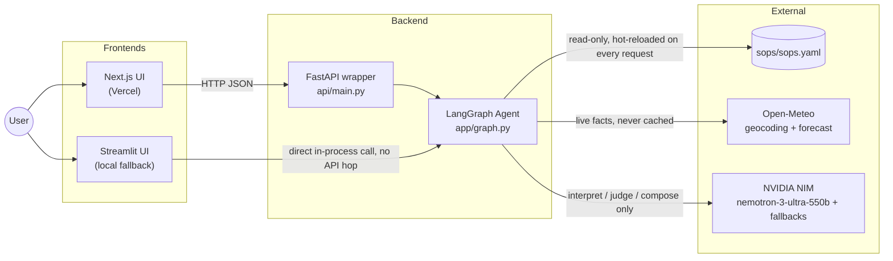
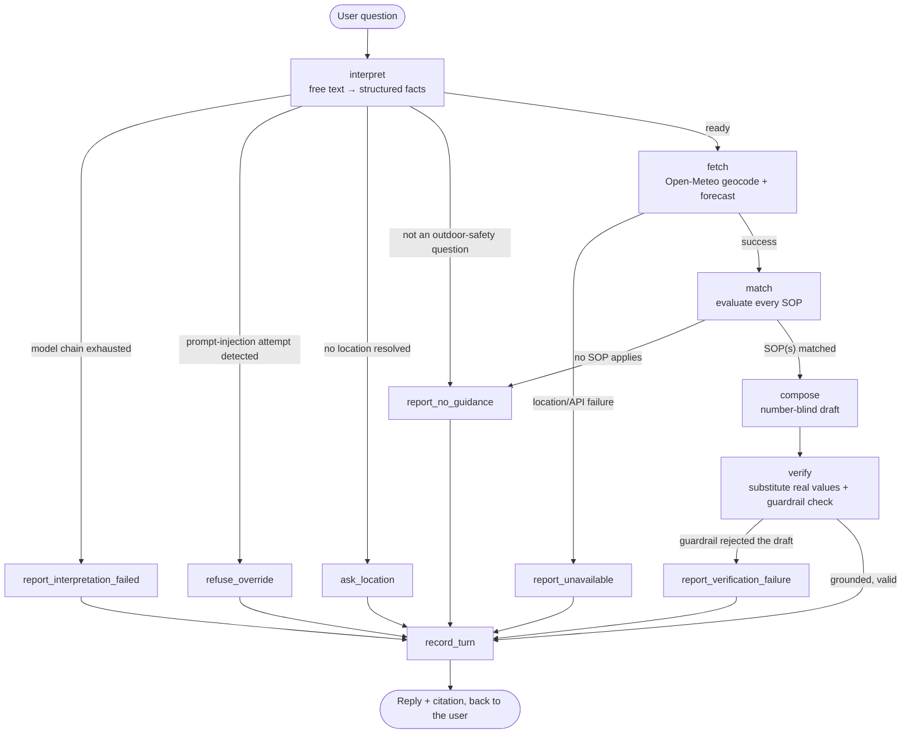

# Weather-Advisory Support Bot

A LangGraph chat agent that answers outdoor-activity safety questions from live
Open-Meteo data, where **every answer is either traceable to a written policy
(SOP) or an explicit refusal**. The model interprets language and phrases the
reply; it never decides what good advice is and never sources a number.

**Live deployment:** see [DEPLOYMENT.md](DEPLOYMENT.md) — Render (backend) +
Vercel (frontend).

## Architecture

### System overview

Two frontends, one thin API wrapper, one LangGraph agent. The agent is the
only thing that talks to weather, the LLM, or the policy file — neither
frontend, and not the API layer, ever does.



The Next.js UI never imports the agent directly — it only ever sees JSON
from `api/main.py`, which itself contains zero business logic (it exists
purely because a browser can't import a Python module). The Streamlit UI
skips the API hop and imports `app/graph.py` directly, which is why it needs
no separate server to run. Both paths go through the exact same graph, so
neither UI can drift from the other's guarantees.

### The graph itself: real branching, not a happy path with a try/except



Six terminal paths, five of them refusals. Every arrow above is a real
conditional edge (`app/graph.py:build_graph`) evaluated against graph state —
the agent physically cannot reach `compose` without a resolved location, a
successful weather fetch, *and* a matched SOP. `report_no_guidance` is one
node reached from two different places (an off-topic question, or an
on-topic question no policy covers) — same honest answer either way, by
design. `record_turn` is the join point: every path, including refusals,
gets written into session history, so even a refusal is context for the
next turn.

### Where the boundary sits — what the model does, what code does

The whole design is one answer to a tension baked into the brief: questions
arrive as free text that must tolerate paraphrasing, but no advice and no
number may originate from the model. The resolution: **the model translates,
it never decides.**

| Concern | Owner | Why |
| --- | --- | --- |
| Understanding paraphrase, resolving follow-ups | model | Irreducibly a language problem |
| Fetching weather | code | Must be the sole fact source |
| Evaluating numeric SOP conditions | code | Auditable, unit-testable, identical every run |
| Ranking conflicting SOPs | code | A policy decision, not a judgment call |
| Judging the one non-numeric SOP | model, narrowly | No threshold exists to check against |
| Wording the reply | model | Language only, no factual authority |
| Substituting real numbers, verifying the draft | code | The "never invents a fact" guarantee has to be mechanical, not promised |

The consequence worth noticing: **paraphrase handling and policy matching
are decoupled.** The model maps "pedal to the office" onto the `cycling`
vocabulary tag; the rules engine then matches purely on that tag against
real weather data. Semantic understanding never touches a policy threshold,
so a fuzzy question can never produce a fuzzy (or fabricated) threshold
decision.

**The sharpest guarantee in the system:** the compose step is number-blind
by construction. It never receives a live weather value — only field
*names* and threshold-relative phrases ("`wind_gusts_10m` is at or above its
policy threshold"). It writes `{wind_gusts_10m}`; `app/validation.py`
substitutes the real figure afterward and rejects the whole draft if any
other numeral appears that isn't a threshold from the SOP's own text. The
model has no number to misreport — it's not just told not to.

### Component responsibilities

| File | Owns |
| --- | --- |
| `sops/sops.yaml` | The policy set. Data, not code — the only source of advice. |
| `app/sop_loader.py` | Loads/validates policy, derives the activity/audience vocabulary, hot-reloads on file change. |
| `app/rules.py` | Generic `{field, op, value}` condition evaluator — no rule-specific code exists anywhere. |
| `app/weather.py` | Open-Meteo geocoding + forecast. The only place a weather fact is ever produced. |
| `app/nodes.py` | Every graph node: interpret, fetch, match, compose, verify, and the six terminal refusals. |
| `app/graph.py` | LangGraph wiring — the diagram above, as code. |
| `app/validation.py` | The output guardrail: placeholder substitution, invented-number and disallowed-field rejection. |
| `app/llm.py` | Provider-agnostic model access with a fallback chain and crash-safe defaults. |
| `api/main.py` | Thin FastAPI wrapper — JSON in front of `app/graph.py`, zero business logic. |
| `web/` | Next.js chat frontend (primary). |
| `frontend/streamlit_app.py` | Minimal fallback UI, imports the agent directly. |
| `evals/test_evals.py` | The correctness eval suite, three layers. |
| `evals/load_test.py` | Concurrency/stress probe (not required by the brief, added anyway). |

Full reasoning behind every decision above — including the ones that turned
out to be wrong on the first attempt, and how that was found — is in
[docs/DESIGN.md](docs/DESIGN.md).

## Setup

```bash
python -m venv .venv
.venv\Scripts\activate        # Windows
# source .venv/bin/activate   # macOS / Linux
pip install -r requirements.txt
cp .env.example .env
```

Put your key in `.env` (it is gitignored):

```
LLM_PROVIDER=anthropic
ANTHROPIC_API_KEY=sk-ant-...
ANTHROPIC_MODEL=claude-sonnet-4-5
```

`LLM_PROVIDER=openai` with `OPENAI_API_KEY` works identically. Open-Meteo needs
no key.

## Run the chat frontend (Next.js — primary)

The main frontend is a Next.js app that talks to a small FastAPI wrapper around
`app/graph.py`. Nothing about the graph, the guardrails or the SOPs changes for
the web UI — the API layer only turns `ask()` into JSON.

```bash
# Terminal 1 - backend API (from the repo root, venv active)
pip install -r requirements.txt
uvicorn api.main:app --reload --port 8000

# Terminal 2 - frontend
cd web
npm install
cp .env.local.example .env.local   # points at http://localhost:8000 by default
npm run dev
```

Open the printed `localhost` URL. The background sky reacts live to the
severity of the last answer (calm/sunny → stormy/lightning for a critical
override), each reply has an expandable **citation card** (policy id,
category, the exact fetched values it was allowed to quote, any co-applying
SOPs) and a **decision trace** (every graph node's routing decision). The
sidebar lists the loaded policy set straight from `sops/sops.yaml` — add an
11th SOP to that file and it shows up on the next question, no restart.

## Run the chat frontend (Streamlit — minimal fallback)

A simpler, dependency-light frontend that talks to the graph directly
in-process (no separate API server needed):

```bash
streamlit run frontend/streamlit_app.py
```

Type a question in the thread. Under each reply, expand **Source** to see the
SOP that produced it and the exact fetched values it was allowed to quote, and
**Decision trace** to see what every node decided, including which SOPs were
evaluated and rejected.

## Run the backend without any UI

```bash
python -c "from app.graph import ask; import json; print(json.dumps(ask('is it safe to cycle in Bhopal today?'), indent=2, default=str))"
```

## Run the evals

```bash
pytest evals -v                 # everything (needs API key + network)
pytest evals -v -m offline      # policy/guardrail layer: no key, no network
pytest evals -v -m model        # full graph with weather stubbed (key only)
pytest evals -v -m "live"       # real Open-Meteo + real model
```

The three markers exist because the layers fail for different reasons:
`offline` proves the rules engine, conflict resolution and output guardrail and
is deterministic forever; `model` proves the graph's routing and refusal paths
with weather injected; `live` is the only layer whose result depends on today's
weather, and it skips loudly rather than passing vacuously when conditions are
calm. See `docs/DESIGN.md` §11.

## Concurrency / stress test (not required, run anyway)

```bash
python evals/load_test.py
```

Not asked for by the brief (which grades correctness/grounding/failure
handling, covered above), but a fair question about production readiness.
Checks concurrent distinct sessions, a same-thread race, and a small real
burst against the live model chain. Writes `verification/LOAD_TEST_RESULTS.md`.

## Verification artifacts

`verification/` holds a dated, committed record of double-checking this repo
against the assignment brief line by line, rather than leaving that only in
conversation:

- `REQUIREMENTS_CHECKLIST.md` — every stated requirement, checked against the
  actual repo state
- `SOP_LIVE_ADD_DEMO.md` — the "add an 11th SOP live" moment the brief calls
  out, actually performed (before/after, zero code touched, zero restart)
- `EVAL_RESULTS.md` — a fresh full test run, including an honest account of a
  real unhandled-crash bug the run itself surfaced, how it was fixed, which
  of the other failures turned out to be transient API contention, and one
  known model-variance limitation left open rather than force-fixed
- `LOAD_TEST_RESULTS.md` — the concurrency probe above

See **Component responsibilities** in the [Architecture](#architecture)
section above for what every file owns; `docs/DESIGN.md` for the full
reasoning; `research/` for background material gathered before building;
`render.yaml` + `DEPLOYMENT.md` for the live deployment.

## The SOPs, and why YAML

`sops/sops.yaml` holds 14 SOPs across 5 categories
(`situational_override`, `outdoor_exercise`, `travel_commute`,
`vulnerable_groups`, `leisure_social`) spanning all five severities from
`informational` to `critical`, including one deliberately non-numeric
judgment-based SOP (`SOP-012`, leisure outings).

**Why YAML:** a policy owner who is not an engineer has to be able to edit this
during a review call. YAML lets each rule carry inline comments explaining its
own thresholds, and the human-readable `guidance` blocks stay readable at
multi-line length without escaping. The cost is whitespace sensitivity, which
the loader mitigates by validating structure on load and failing loudly with the
offending SOP id rather than silently never matching.

## Adding an 11th SOP without touching code

Append a block to `sops/sops.yaml` and ask the next question. No restart, no
code change. The loader re-reads on file mtime change, and it derives the
activity/audience vocabulary, the severity ranking and the citable-field
allowlist from the file itself — so a new SOP that introduces an activity tag
nobody has used before immediately becomes something the interpreter can select.

This isn't hypothetical — it was actually performed during this build, with
the running FastAPI server never restarted. See
[verification/SOP_LIVE_ADD_DEMO.md](verification/SOP_LIVE_ADD_DEMO.md) for the
full before/after proof. The block added (now a real, permanent SOP-014 in
`sops/sops.yaml`, which is why the count above is 14, not 13):

```yaml
  - id: SOP-014
    title: Reduced visibility during outdoor exercise (haze / low air quality)
    category: outdoor_exercise
    severity: moderate
    applies_to:
      activities: [running, cycling, walking, hiking]
      audiences: [any]
    conditions:
      all_of:
        - {field: visibility, op: "<=", value: 4000}
    cite_fields: [visibility, resolved_location]
    guidance: >
      Advise shortening or relocating the session while visibility is at or
      below 4000 m, since haze or particulate loading at this level can
      irritate airways during sustained exertion. Recommend an indoor
      alternative for anyone with asthma or a respiratory condition, and
      recommend a lower-intensity effort if the session goes ahead outdoors.
```

The one honest caveat: a genuinely new *kind* of comparison (say geospatial
distance, or a time-of-day window as a first-class operator) would need a new
operator in `app/rules.py`. Adding rules needs no code; inventing a new
primitive does. See `docs/DESIGN.md` for the full statement of this limit.
